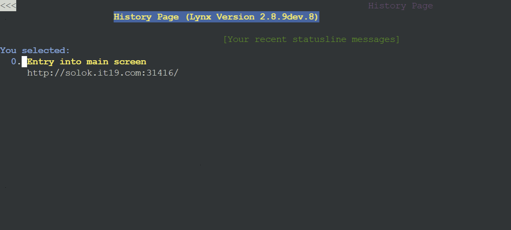
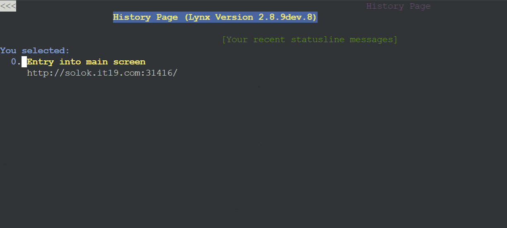

# Modul 2 Jarkom

| Name               |      NRP    |
|--------------------|-------------|
| Fiorenza Adelia Nalle | 5027231053 |

## Daftar Isi

1. [Soal 1](#soal-1)
2. [Soal 2](#soal-2)
3. [Soal 3](#soal-3)
4. [Soal 4](#soal-4)
5. [Soal 5](#soal-5)
6. [Soal 6](#soal-6)
7. [Soal 7](#soal-7)
8. [Soal 8](#soal-8)
9. [Soal 9](#soal-9)
10. [Soal 10](#soal-10)
11. [Soal 11](#soal-11)
12. [Soal 12](#soal-12)
13. [Soal 13](#soal-13)
14. [Soal 14](#soal-14)
15. [Soal 15](#soal-15)
16. [Soal 16](#soal-16)
17. [Soal 17](#soal-17)
18. [Soal 18](#soal-18)
19. [Soal 19](#soal-19)
20. [Soal 20](#soal-20)

## Topologi


## Soal 1 
1. Untuk mempersiapkan peperangan World War MMXXIV (Iya sebanyak itu), **Sriwijaya** membuat dua kotanya menjadi web server yaitu **Tanjungkulai,** dan **Bedahulu**, serta **Sriwijaya** sendiri akan menjadi DNS Master. Kemudian karena merasa terdesak, **Majapahit** memberikan bantuan dan menjadikan kerajaannya (**Majapahit)** menjadi **DNS Slave**.

Nusantara (Router) :

```jsx
auto eth0
iface eth0 inet dhcp

auto eth1
iface eth1 inet static
address 10.73.1.1
netmask 255.255.255.0

auto eth2
iface eth2 inet static
address 10.73.2.1
netmask 255.255.255.0

auto eth3
iface eth3 inet static
address 10.73.3.1
netmask 255.255.255.0
```

Sriwijaya (DNS Master):

```jsx
auto eth0
iface eth0 inet static
address 10.73.1.3
netmask 255.255.255.0
gateway 10.73.1.1
```

Tanjungkulai (WebServer) :

```jsx
auto eth0
iface eth0 inet static
address 10.73.1.4
netmask 255.255.255.0
gateway 10.73.1.1
```

Bedahulu (WebServer) :

```jsx
auto eth0
iface eth0 inet static
address 10.73.1.5
netmask 255.255.255.0
gateway 10.73.1.1
```

Kotalingga (WebServer) :

```jsx
auto eth0
iface eth0 inet static
address 10.73.1.6
netmask 255.255.255.0
gateway 10.73.1.1
```

Majapahit (DNS Slave) :

```jsx
auto eth0
iface eth0 inet static
address 10.73.2.2
netmask 255.255.255.0
gateway 10.73.2.1
```

Solok (LoadBalancer) :

```jsx
auto eth0
iface eth0 inet static
address 10.73.2.3
netmask 255.255.255.0
gateway 10.73.2.1
```

ThomasAlfaEdison (Client) :

```jsx
auto eth0
iface eth0 inet static
address 10.73.3.2
netmask 255.255.255.0
gateway 10.73.3.1
```

GajahMada (Client) :

```jsx
auto eth0
iface eth0 inet static
address 10.73.3.3
netmask 255.255.255.0
gateway 10.73.3.1
```

HayamWuruk (Client) :

```jsx
auto eth0
iface eth0 inet static
address 10.73.3.3
netmask 255.255.255.0
gateway 10.73.3.1
```

Tambahkan up iptables -t nat -A POSTROUTING -o eth0 -j MASQUERADE ke Nusantara

```jsx
auto eth0
iface eth0 inet dhcp
up iptables -t nat -A POSTROUTING -o eth0 -j MASQUERADE

auto eth1
iface eth1 inet static
address 10.73.1.1
netmask 255.255.255.0

auto eth2
iface eth2 inet static
address 10.73.2.1
netmask 255.255.255.0

auto eth3
iface eth3 inet static
address 10.73.3.1
netmask 255.255.255.0
```

dan tambahkan up echo nameserver 192.168.122.1 > /etc/resolv.conf ke setiap node lain

## Soal 2
2.  Karena para pasukan membutuhkan koordinasi untuk melancarkan serangannya, maka buatlah sebuah domain yang mengarah ke **Solok** dengan alamat **sudarsana.xxxx.com** dengan alias **www.sudarsana.xxxx.com,** dimana **xxxx** merupakan kode kelompok. Contoh: **sudarsana.it01.com**.

Jalankan di Sriwijaya

```jsx
apt-get update -y
```

```jsx
apt-get install bind9 -y
```

```jsx
nano /etc/bind/named.conf.local
```

```jsx
zone "sudarsana.it19.com" {
type master;
file "/etc/bind/it19/sudarsana.it19.com";
};
```

```jsx
mkdir /etc/bind/it19
```

```jsx
cp /etc/bind/db.local /etc/bind/it19/sudarsana.it19.com
```

```jsx
nano /etc/bind/it19/sudarsana.it19.com
```

```jsx
;
; BIND data file for local loopback interface
;
$TTL    604800
@       IN      SOA     sudarsana.it19.com. root.sudarsana.it19.com. (
                              2         ; Serial
                         604800         ; Refresh
                          86400         ; Retry
                        2419200         ; Expire
                         604800 )       ; Negative Cache TTL
;
@       IN      NS      sudarsana.it19.com.
@       IN      A       10.73.2.3
@       IN      AAAA    ::1
www     IN      CNAME   sudarsana.it19.com.
```

```jsx
service bind9 restart
```

## Soal 3

3.  Para pasukan juga perlu mengetahui mana titik yang akan diserang, sehingga dibutuhkan domain lain yaitu **pasopati.xxxx.com** dengan alias **www.pasopati.xxxx.com** yang **mengarah ke Kotalingga**.

Jalankan di Sriwijaya

```jsx
nano /etc/bind/named.conf.local
```

```jsx
zone "pasopati.it19.com" {
type master;
file "/etc/bind/it19/pasopati.it19.com";
};
```

```jsx
cp /etc/bind/db.local /etc/bind/it19/pasopati.it19.com
```

```jsx
nano /etc/bind/it19/pasopati.it19.com
```

```jsx
;
; BIND data file for local loopback interface
;
$TTL    604800
@       IN      SOA     pasopati.it19.com. root.pasopati.it19.com. (
                              2         ; Serial
                         604800         ; Refresh
                          86400         ; Retry
                        2419200         ; Expire
                         604800 )       ; Negative Cache TTL
;
@       IN      NS      pasopati.it19.com.
@       IN      A       10.73.1.6
@       IN      AAAA    ::1
www     IN      CNAME   pasopati.it19.com.
```

```jsx
service bind9 restart
```

## Soal 4

4.  Markas pusat meminta dibuatnya domain khusus untuk menaruh informasi persenjataan dan suplai yang tersebar. Informasi dan suplai meme terbaru tersebut **mengarah ke Tanjungkulai** dan domain yang ingin digunakan adalah **rujapala.xxxx.com** dengan alias **www.rujapala.xxxx.com**

Jalankan di Sriwijaya

```jsx
nano /etc/bind/named.conf.local
```

```jsx
zone "rujapala.it19.com" {
type master;
file "/etc/bind/it19/rujapala.it19.com";
};
```

```jsx
cp /etc/bind/db.local /etc/bind/it19/rujapala.it19.com
```

```jsx
nano /etc/bind/it19/rujapala.it19.com
```

```jsx
;
; BIND data file for local loopback interface
;
$TTL    604800
@       IN      SOA     rujapala.it19.com. root.rujapala.it19.com. (
                              2         ; Serial
                         604800         ; Refresh
                          86400         ; Retry
                        2419200         ; Expire
                         604800 )       ; Negative Cache TTL
;
@       IN      NS      rujapala.it19.com.
@       IN      A       10.73.1.4
@       IN      AAAA    ::1
www     IN      CNAME   rujapala.it19.com.
```

```jsx
service bind9 restart
```

## Soal 5

5. Pastikan domain-domain tersebut dapat diakses oleh **seluruh komputer (client)** yang berada di **Nusantara**.

Tambahkan ini di setiap konfigurasi client

```jsx
up echo nameserver 10.73.1.3 >> /etc/resolv.conf
up echo nameserver 10.73.2.2  >> /etc/resolv.conf
```

Hayamwuruk

```jsx
auto eth0
iface eth0 inet static
address 10.73.1.2
netmask 255.255.255.0
gateway 10.73.1.1
up echo nameserver 10.73.1.3 >> /etc/resolv.conf
up echo nameserver 10.73.2.2  >> /etc/resolv.conf
```

ThomasAlfaEdison

```jsx
auto eth0
iface eth0 inet static
address 10.73.3.2
netmask 255.255.255.0
gateway 10.73.3.1
up echo nameserver 10.73.1.3 >> /etc/resolv.conf
up echo nameserver 10.73.2.2  >> /etc/resolv.conf
```

GajahMada

```jsx
auto eth0
iface eth0 inet static
address 10.73.3.3
netmask 255.255.255.0
gateway 10.73.3.1
up echo nameserver 10.73.1.3 >> /etc/resolv.conf
up echo nameserver 10.73.2.2  >> /etc/resolv.conf
```

Lalu  test di setiap client

```jsx
ping sudarsana.it19.com -c 3
ping rujapala.it19.com -c 3
ping pasopati.it19.com -c 3
```


## Soal 6

6. Beberapa daerah memiliki keterbatasan yang menyebabkan **hanya dapat** mengakses domain secara langsung melalui **alamat IP** domain tersebut. Karena daerah tersebut tidak diketahui secara spesifik, pastikan semua komputer (client) dapat mengakses domain **pasopati.xxxx.com** melalui **alamat IP Kotalingga** (Notes: menggunakan pointer record).

IP Kotalingga adalah 10.73.1.6

Jalankan di Sriwijaya

```jsx
nano /etc/bind/named.conf.local
```

```jsx
zone "1.73.10.in-addr.arpa" {
type master;
file "/etc/bind/it19/1.73.10.in-addr.arpa";
};
```

```jsx
cp /etc/bind/db.local /etc/bind/it19/1.73.10.in-addr.arpa
```

```jsx
nano /etc/bind/it19/1.73.10.in-addr.arpa
```

```jsx
;
; BIND data file for local loopback interface
;
$TTL    604800
@       IN      SOA     pasopati.it19.com. root.pasopati.it19.com. (
                              2         ; Serial
                         604800         ; Refresh
                          86400         ; Retry
                        2419200         ; Expire
                         604800 )       ; Negative Cache TTL
;
1.73.10.in-addr.arpa.         IN      NS      pasopati.it19.com.
6                             IN      PTR     pasopati.it19.com.
```

```jsx
service bind9 restart
```

Lalu jalankan ini di client 

```jsx
host -t PTR 10.73.1.6
```


## Soal 7

7. Akhir-akhir ini seringkali terjadi **serangan brainrot** ke DNS Server Utama, sebagai tindakan antisipasi kamu diperintahkan untuk membuat **DNS Slave di Majapahit** untuk **semua domain** yang sudah dibuat sebelumnya yang mengarah ke **Sriwijaya**.

Di Sriwijaya

```jsx
nano /etc/bind/named.conf.local
```

```jsx
zone "sudarsana.it19.com" {
		type master;
		also-notify { 10.73.2.2; }; // IP Majapahit
		allow-transfer { 10.73.2.2; }; // IP Majapahit
		file "/etc/bind/it19/sudarsana.it19.com";
};

zone "pasopati.it19.com" {
		type master;
		also-notify { 10.73.2.2; }; // IP Majapahit
		allow-transfer { 10.73.2.2; }; // IP Majapahit
		file "/etc/bind/it19/pasopati.it19.com";
};

zone "rujapala.it19.com" {
		type master;		
		also-notify { 10.73.2.2; }; // IP Majapahit
		allow-transfer { 10.73.2.2; }; // IP Majapahit
		file "/etc/bind/it19/rujapala.it19.com";
};

zone "1.73.10.in-addr.arpa" {
		type master;
		also-notify { 10.73.2.2; }; // IP Majapahit
		allow-transfer { 10.73.2.2; }; // IP Majapahit
		file "/etc/bind/it19/1.73.10.in-addr.arpa";
};
```

```jsx
service bind9 restart
```

Di Majapahit

```jsx
apt-get update
apt-get install bind9 -y
```

```jsx
service bind9 start
```

```jsx
nano /etc/bind/named.conf.local
```

```jsx
zone "sudarsana.it19.com" {
		type slave;
		masters { 10.73.1.3; }; //IP Sriwijaya
		file "/var/lib/bind/sudarsana.it19.com";
};

zone "pasopati.it19.com" {
		type slave;
		masters { 10.73.1.3; }; //IP Sriwijaya
		file "/var/lib/bind/pasopati.it19.com";
};

zone "rujapala.it19.com" {
		type slave;
		masters { 10.73.1.3; }; //IP Sriwijaya
		file "/var/lib/bind/rujapala.it19.com";
};

zone "1.73.10.in-addr.arpa" {
		type slave;
		masters { 10.73.1.3; }; //IP Sriwijaya
		file "/var/lib/bind/1.73.10.in-addr.arpa";
};
```

```jsx
service bind9 restart
```

Testingnya pas Sriwijaya di matiin dan nyala hanya di Majapahit saat di ping di client tetap bisa

```jsx
ping sudarsana.it19.com -c 3
ping rujapala.it19.com -c 3
ping pasopati.it19.com -c 3
```


## Soal 8

8. Kamu juga diperintahkan untuk membuat subdomain khusus melacak kekuatan tersembunyi **di Ohio** dengan subdomain **cakra.sudarsana.xxxx.com** yang mengarah ke Bedahulu.

Pada Sriwijaya

```jsx
nano /etc/bind/it19/sudarsana.it19.com
```

```jsx
;
; BIND data file for local loopback interface
;
$TTL    604800
@       IN      SOA     sudarsana.it19.com. root.sudarsana.it19.com. (
                              2         ; Serial
                         604800         ; Refresh
                          86400         ; Retry
                        2419200         ; Expire
                         604800 )       ; Negative Cache TTL
;
@       IN      NS      sudarsana.it19.com.
@       IN      A       10.73.2.3
@       IN      AAAA    ::1
www     IN      CNAME   sudarsana.it19.com.
cakra		IN      A       10.73.1.5
www.cakra	IN      CNAME   cakra.sudarsana.it19.com.
```

```jsx
service bind9 restart
```

Test ping pada tiap client

```jsx
ping cakra.sudarsana.it19.com
```


## Soal 9

9. Karena terjadi serangan DDOS oleh shikanoko nokonoko koshitantan (NUN), sehingga sistem komunikasinya terhalang. Untuk melindungi warga, kita diperlukan untuk membuat sistem peringatan dari siren man oleh Frekuensi Freak dan memasukkannya ke subdomain **panah.pasopati.xxxx.com** dalam folder panah dan pastikan dapat diakses secara mudah dengan menambahkan alias **www.panah.pasopati.xxxx.com** dan mendelegasikan subdomain tersebut ke **Majapahit** dengan alamat IP menuju radar di **Kotalingga**.

Edit file menjadi seperti berikut ini di Sriwijaya

```jsx
nano /etc/bind/named.conf.options
```

```
options {
directory \"/var/cache/bind\";

allow-query {any;};

auth-nxdomain no;
listen-on-v6 { any; };
}
```

Pada Majapahit

```jsx
cd etc/bind/named.conf.local
```

```jsx
zone "panah.pasopati.it19.com" {
type master;
allow-transfer { 10.73.1.3; }; // IP Sriwijaya
file "/etc/bind/it19/panah.pasopati.it19.com";
};
```

```jsx
mkdir /etc/bind/it19
```

```jsx
nano /etc/bind/it19/panah.pasopati.it19.com
```

```jsx
;
; BIND data file for local loopback interface
;
$TTL    604800
@       IN      SOA     panah.pasopati.it19.com. root.panah.pasopati.it19.com. (
												2				; Serial
												604800			; Refresh
												86400			; Retry
												2419200         ; Expire
												604800 )		; Negative Cache TTL
;
@       IN      NS      panah.pasopati.it19.com.
@       IN      A       10.73.1.6
www     IN      CNAME   panah.pasopati.it19.com.
```

```jsx
service bind9 restart
```

Pada Sriwijaya
```
service bind9 stop
```

Test ping pada tiap client

```jsx
ping panah.pasopati.it19.com
```


## Soal 10

10. Markas juga meminta catatan kapan saja meme brain rot akan dijatuhkan, maka buatlah subdomain baru di subdomain panah yaitu **log.panah.pasopati.xxxx.com** serta aliasnya **www.log.panah.pasopati.xxxx.com** yang juga mengarah ke **Kotalingga.**

Pada Majapahit

```jsx
nano /etc/bind/it19/panah.pasopati.it19.com
```

```jsx
;
; BIND data file for local loopback interface
;
$TTL    604800
@       IN      SOA     panah.pasopati.it19.com. root.panah.pasopati.it19.com. (
												2				; Serial
												604800			; Refresh
												86400			; Retry
												2419200         ; Expire
												604800 )		; Negative Cache TTL
;
@       IN      NS      panah.pasopati.it19.com.
@       IN      A       10.73.1.6
www     IN      CNAME   panah.pasopati.it19.com.
log     IN      A       10.73.1.6
www.log IN      CNAME   log.panah.pasopati.it19.com.
```

```jsx
service bind9 restart
```

Test ping pada tiap client

```jsx
ping log.panah.pasopati.it19.com
```


## Soal 11

11. Setelah pertempuran mereda, warga IT dapat kembali mengakses jaringan luar dan menikmati meme brainrot terbaru, tetapi hanya warga Majapahit saja yang dapat mengakses jaringan luar secara langsung. Buatlah konfigurasi agar warga IT yang berada diluar Majapahit dapat mengakses jaringan luar melalui DNS Server Majapahit.

Pada DNS Majapahit

```jsx
nano /etc/bind/named.conf.options
```

```
options {
directory \"/var/cache/bind\";

forwarders {
	192.168.122.1; 
};

allow-query {any;};

auth-nxdomain no;
listen-on-v6 { any; };
}
```

```jsx
service bind9 restart
```

Lalu coba ping [google.com](http://google.com) pada tiap client

```jsx
ping google.com
```


## Soal 12

12. Karena pusat ingin sebuah laman web yang ingin digunakan untuk memantau kondisi kota lainnya maka deploy laman web ini (cek resource yg lb) pada **Kotalingga** menggunakan **apache.**

Pada Kotalingga

```jsx
apt-get update
apt-get install lynx apache2 php libapache2-mod-php7.0 wget unzip -y
```

```jsx
cp /etc/apache2/sites-available/000-default.conf /etc/apache2/sites-available/it19.conf
```

```jsx
rm /etc/apache2/sites-enabled/000-default.conf
```

```jsx
nano /etc/apache2/sites-available/it19.conf
```

```jsx
<VirtualHost *:8080>
ServerAdmin webmaster@localhost
DocumentRoot /var/www/html
</VirtualHost>
```

```jsx
nano /etc/apache2/ports.conf
```

```jsx
Listen 80
Listen 8080

<IfModule ssl_module>
Listen 443
</IfModule>

<IfModule mod_gnutls.c>
Listen 443
</IfModule>
```

```jsx
a2ensite it19.conf
```

```jsx
mkdir -p /var/www/html/configuration/

wget --no-check-certificate 'https://drive.google.com/uc?export=download&id=1Sqf0TIiybYyUp5nyab4twy9svkgq8bi7' -O /var/www/html/configuration/lb.zip

unzip /var/www/html/configuration/lb.zip -d /var/www/html/configuration/

mv /var/www/html/configuration/worker/index.php /var/www/html/

rm -rf /var/www/html/configuration/
```

```jsx
service apache2 start
```

Testing pada Kotalingga

```jsx
lynx 10.73.1.6/index.php
```


## Soal 13

13. Karena Sriwijaya dan Majapahit memenangkan pertempuran ini dan memiliki banyak uang dari hasil penjarahan (sebanyak 35 juta, belum dipotong pajak) maka pusat meminta kita memasang load balancer untuk membagikan uangnya pada web nya, dengan **Kotalingga, Bedahulu, Tanjungkulai** sebagai worker dan **Solok** sebagai **Load Balancer** menggunakan apache sebagai web server nya dan load balancer nya.

Setup tiap webserver seperti pada no 12 

```jsx
#!/bin/bash

# Update the package repository and install necessary packages
apt-get update
apt-get install lynx apache2 php libapache2-mod-php7.0 wget unzip -y

# Copy the default Apache configuration and create a new configuration for the site
cp /etc/apache2/sites-available/000-default.conf /etc/apache2/sites-available/it19.conf

# Remove the default enabled site configuration
rm /etc/apache2/sites-enabled/000-default.conf

# Modify the configuration file for the site (echoing directly into the file)
cat <<EOL > /etc/apache2/sites-available/it19.conf
<VirtualHost *:8080>
    ServerAdmin webmaster@localhost
    DocumentRoot /var/www/html
</VirtualHost>
EOL

# Modify the ports configuration to listen on ports 80 and 8080
cat <<EOL > /etc/apache2/ports.conf
Listen 80
Listen 8080

<IfModule ssl_module>
    Listen 443
</IfModule>

<IfModule mod_gnutls.c>
    Listen 443
</IfModule>
EOL

# Enable the new site configuration
a2ensite it19.conf

# Create the necessary directories and download the configuration file
mkdir -p /var/www/html/configuration/
wget --no-check-certificate 'https://drive.google.com/uc?export=download&id=1Sqf0TIiybYyUp5nyab4twy9svkgq8bi7' -O /var/www/html/configuration/lb.zip

# Unzip the downloaded file and move the relevant files
unzip /var/www/html/configuration/lb.zip -d /var/www/html/configuration/
mv /var/www/html/configuration/worker/index.php /var/www/html/

# Remove the configuration directory
rm -rf /var/www/html/configuration/

# Start the Apache2 service
service apache2 start

# Output completion status
echo "Apache2 has been configured and started on port 8080."
```

Pada solok

```jsx
apt-get update
apt-get install lynx apache2 -y
```

```jsx
a2enmod proxy
a2enmod proxy_http
a2enmod proxy_balancer
a2enmod lbmethod_byrequests
```

```jsx
service apache2 start
```

```jsx
nano /etc/apache2/sites-available/default-8080.conf
```

```jsx
<VirtualHost *:8080>
    ServerAdmin webmaster@localhost
    DocumentRoot /var/www/it19

    ProxyRequests Off
    <Proxy balancer://mycluster>
        BalancerMember http://10.73.1.4:8080
        BalancerMember http://10.73.1.5:8080
        BalancerMember http://10.73.1.6:8080
        ProxySet lbmethod=byrequests
    </Proxy>

    ProxyPass / balancer://mycluster/
    ProxyPassReverse / balancer://mycluster/
</VirtualHost>
```

```jsx
service apache2 restart
```

Pada tiap webserver

```jsx
a2ensite it19.conf
```

```jsx
service apache2 restart
```

Testing

```jsx
lynx 10.73.1.4:8080/index.php
```


```jsx
lynx 10.73.1.5:8080/index.php
```


```jsx
lynx 10.73.1.6:8080/index.php
```


## Soal 14

14. Selama melakukan penjarahan mereka melihat bagaimana web server luar negeri, hal ini membuat mereka iri, dengki, sirik dan ingin flexing sehingga meminta agar web server dan load balancer nya **diubah menjadi nginx**.

Setup pada tiap webserver

```jsx
apt-get update
apt-get install dnsutils lynx nginx apache2 libapache2-mod-php7.0 wget unzip php php-fpm -y
```

```jsx
service php7.0-fpm start
```

```jsx
service apache2 stop
```

```jsx
service nginx start
```

```
mkdir -p /var/www/html/configuration/

wget --no-check-certificate 'https://drive.google.com/uc?export=download&id=1Sqf0TIiybYyUp5nyab4twy9svkgq8bi7' -O /var/www/html/configuration/lb.zip

unzip /var/www/html/configuration/lb.zip -d /var/www/html/configuration/

mv /var/www/html/configuration/worker/index.php /var/www/html/

rm -rf /var/www/html/configuration/
```

```jsx
nano /etc/nginx/sites-available/it19
```

Listen sesuaikan webservernya, 8082 untuk Tanjungkulai, 8083 untuk Bedahulu, dan 8084 untuk Kutalingga

```jsx
server {
    listen 8082;

    root /var/www/html;

    index index.php index.html index.htm;
    server_name _;

    location / {
        try_files \$uri \$uri/ /index.php?\$query_string;
    }

    # pass PHP scripts to FastCGI server
    location ~ \.php$ {
        include snippets/fastcgi-php.conf;
        fastcgi_pass unix:/var/run/php/php7.0-fpm.sock;
    }

    location ~ /\.ht {
     deny all;
    }

    error_log /var/log/nginx/it19_error.log;
    access_log /var/log/nginx/it19_access.log;
}
```

```jsx
ln -s /etc/nginx/sites-available/it19 /etc/nginx/sites-enabled
```

```jsx
rm /etc/nginx/sites-enabled/default
```

```jsx
service nginx restart
```

Di loadbalancer

```jsx
apt-get update
apt-get install dnsutils nginx php-fpm php -y
```

```jsx
service php7.0-fpm start
```

```jsx
service apache2 stop
```

```jsx
service nginx start
```

```jsx
nano /etc/nginx/sites-available/it19
```

```jsx
upstream solok {
    server 10.73.1.4:8082; # Tanjungkulai
    server 10.73.1.5:8083; # Bedahulu
    server 10.73.1.6:8084; # Kotalingga
}

server {
  listen 8082;
  server_name 10.73.2.3;

  location / {
    proxy_pass http://solok;
  }
}

server {
  listen 8083;
  server_name 10.73.2.3;

  location / {
    proxy_pass http://solok;
  }
}

server {
  listen 8084;
  server_name 10.73.2.3;

  location / {
    proxy_pass http://solok;
  }
}
```

Testing

```jsx
lynx 10.73.1.4:8082/index.php
```


```jsx
lynx 10.73.1.5:8083/index.php
```


```jsx
lynx 10.73.1.6:8084/index.php
```


## Soal 15

15. Markas pusat meminta **laporan hasil benchmark** dengan menggunakan apache benchmark dari load balancer dengan 2 web server yang berbeda tersebut dan meminta secara detail dengan ketentuan:
- Nama Algoritma Load Balancer
- Report hasil testing apache benchmark
- Grafik request per second untuk masing masing algoritma.
- Analisis
- Meme terbaik kalian (terserah ( ͡° ͜ʖ ͡°)) 🤓

Pada client 

```jsx
apt-get install apache2-utils
```

```jsx
ab -n 1000 -c 100 https://10.73.2.3/
```


## Soal 16

16. Karena dirasa kurang aman dari brainrot karena masih memakai IP, markas ingin akses ke **Solok** memakai **solok.xxxx.com** dengan alias **www.solok.xxxx.com** (sesuai web server terbaik hasil analisis kalian).

Setup di Sriwijaya

```jsx
nano etc/bind/named.conf.local
```

```jsx
zone "solok.it19.com" {
    type master;
    file "/etc/bind/it19/solok.it19.com";
};
```

```jsx
nano /etc/bind/it19/solok.it19.com
```

```jsx
; BIND data file for Solok domain to Solok
$TTL    604800
@       IN      SOA     solok.it19.com. root.solok.it19.com. (
												2				; Serial
												604800			; Refresh
												86400			; Retry
												2419200         ; Expire
												604800 )		; Negative Cache TTL
;
@       IN      NS      solok.it19.com.
@       IN      A       10.73.2.3
www     IN      CNAME   solok.it19.com.
```

```jsx
service bind9 restart
```

Pada loadbalancer

```jsx
service nginx stop
```

```jsx
nano /etc/nginx/sites-enabled/default
```

```jsx
upstream backend {
    server 10.73.1.4:8082; # Tanjungkulai
    server 10.73.1.5:8083; # Bedahulu
    server 10.73.1.6:8084; # Kotalingga
}

server {
    listen 80;
    server_name solok.it19.com www.solok.it19.com; 

    location / {
        proxy_pass http://backend;
    }
}
```

```jsx
service nginx restart
```

Testing pada client

```jsx
apt-get install lynx -y
lynx http://solok.it19.com
lynx http://www.solok.it19.com
```

Pada ThomasAlfaEdison


Pada HayamWuruk


Pada GajahMada


## Soal 17

17. Agar aman, buatlah konfigurasi agar **solok.xxx.com hanya dapat diakses** melalui **port sebesar π x 10^4 = (phi nya desimal) dan 2000 + 2000 log 10 (10) +700 - π = ?**.

Di loadbalancer

```jsx
nano /etc/nginx/sites-enabled/default
```

```jsx
upstream backend {
    server 10.73.1.4:8082; # Tanjungkulai
    server 10.73.1.5:8083; # Bedahulu
    server 10.73.1.6:8084; # Kotalingga
}

server {
    listen 4697;
    listen 31416;
    server_name solok.it19.com www.solok.it19.com; 

    location / {
        proxy_pass http://backend;
    }
}
```

```jsx
service nginx reste
```

Testing di client

```jsx
lynx solok.it19.com:4697
lynx solok.it19.com:31416
```

Pada GajahMada




Pada HayamWuruk


ThomasAlfaEdison




## Soal 18

18. Apa bila ada yang mencoba mengakses IP solok akan secara otomatis dialihkan ke **www.solok.xxxx.com.**

Pada Sriwijaya

```jsx
nano /etc/bind/named.conf.local
```

```jsx
zone "2.73.10.in-addr.arpa" {
        type master;
        notify yes;
        also-notify { 10.73.2.3; };
        allow-transfer { 10.73.2.3; };
        file "/etc/bind/it19.73.10.in-addr.arpa";
};
```

```jsx
nano /etc/bind/it19/2.73.10.in-addr.arpa
```

```jsx
;
; BIND data file for local loopback interface
;
$TTL    604800
@       IN      SOA    solok.it19.com. root.solok.it19.com. (
                              2         ; Serial
                         604800         ; Refresh
                          86400         ; Retry
                        2419200         ; Expire
                         604800 )       ; Negative Cache TTL
; PTR Records
2.73.10.in-addr.arpa.    IN      NS      solok.it19.com.
3                        IN      PTR     www.solok.it19.com.
```

Pada Solok

```jsx
nano /etc/nginx/sites-enabled/default
```

```jsx
upstream backend {
    server 10.73.1.4:8082; # Tanjungkulai
    server 10.73.1.5:8083; # Bedahulu
    server 10.73.1.6:8084; # Kotalingga
}

server {
    listen 3997;
    listen 31416;
    server_name solok.it19.com www.solok.it19.com; 

    location / {
        proxy_pass http://backend;
	}
}
    
server {
    listen 80;  
    server_name 10.73.2.3;

    return 301 http://solok.it19.com$request_uri;
}
```

Testing

```jsx
host -t PTR 10.73.2.3
```

```jsx
lynx http://10.73.2.3:4697
lynx http://10.73.2.3:31416
```


## Soal 19

19. Karena probset sudah kehabisan ide masuk ke **salah satu** worker buatkan akses direktori listing yang mengarah ke resource worker2.

Pada salah satu webserver, disini saya menggunakan Kotalingga

```bash
#!/bin/bash

# Create the configuration directory if it doesn't exist
mkdir -p /var/www/html/configuration/

# Download the file from Google Drive (ignoring certificate check)
wget --no-check-certificate 'https://drive.google.com/uc?export=download&id=1JGk8b-tZgzAOnDqTx5B3F9qN6AyNs7Zy' -O /var/www/html/configuration/worker2.zip

# Unzip the downloaded file to the configuration directory
unzip /var/www/html/configuration/worker2.zip -d /var/www/html/configuration/

# Move the worker2 directory to the desired location
mv /var/www/html/configuration/dir-listing/worker2 /var/www/sekiantterimakasih.it19.com/

# Remove the configuration directory
rm -rf /var/www/html/configuration/

# Output completion status
echo "Process completed successfully."

```

Lalu setup konfigurasi

```jsx
nano /etc/apache2/sites-available/sekiantterimakasih.it19.conf
```

```jsx
<VirtualHost *:80>

	ServerAdmin webmaster@localhost
	DocumentRoot /var/www/sekiantterimakasih.it19.com
	ServerName sekiantterimakasih.it19.com
	ServerAlias www.sekiantterimakasih.it19.com
	
	<Directory /var/www/sekiantterimakasih.it19.com/worker2>
		Options +Indexes
	</Directory>
	
	ErrorLog ${APACHE_LOG_DIR}/sekiantterimakasih_access.log
	CustomLog ${APACHE_LOG_DIR}/sekiantterimakasih_access.log combined
</VirtualHost>
```

```jsx
a2ensite sekiantterimakasih.it19.com
```

Testing di client

```jsx
lynx 10.73.1.6/worker2
```


## Soal 20

20. Worker tersebut harus dapat di akses dengan **sekiantterimakasih.xxxx.com** dengan alias **www.sekiantterimakasih.xxxx.com.**

Pada Sriwijaya

```jsx
nano /etc/bind/named.conf.local
```

```jsx
zone "sekiantterimakasih.it19.com" {
        type master;
        file "/etc/bind/it19/sekiantterimakasih.it19.com";
};
```

```jsx
nano /etc/bind/it19/sekiantterimakasih.it19.com
```

```jsx
;
; BIND data file for local loopback interface
;
$TTL    604800
@       IN      SOA     sekiantterimakasih.it19.com. root.sekiantterimakasih.it19.com. (
                              2         ; Serial
                         604800         ; Refresh
                          86400         ; Retry
                        2419200         ; Expire
                         604800 )       ; Negative Cache TTL
;
@             IN      NS      sekiantterimakasih.it19.com.
@             IN      A       10.73.1.6
www           IN      CNAME   sekiantterimakasih.it19.com.
```

Testing di client

```jsx
lynx sekiantterimakasih.it19.com/worker2
```


